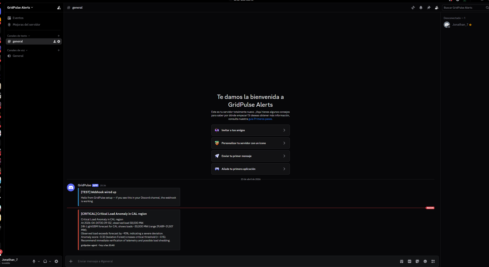

🌐 [English](README.md) · **Español**

# ⚡ GridPulse — Agente de Inteligencia en Tiempo Real para la Red Eléctrica

> **Delta (o Kafka) → Spark Structured Streaming → modelo de anomalías registrado en MLflow → agente LLM con tool use → alerta en Discord.**

Tercer proyecto del portfolio energético. Mientras [`energy-forecasting-databricks`](https://github.com/jsanchez-ds/energy-forecasting-databricks) hizo ML clásico y [`energyscholar-rag`](https://github.com/jsanchez-ds/energyscholar-rag) hizo LLM/RAG, **GridPulse es la capa de streaming + agente que los une en un solo sistema** — el detector de anomalías se consume desde el MLflow Registry del Project 1, la herramienta `search_literature` llama al endpoint HTTP del Project 2, y el agente razona sobre ambos.

---

## 🏗️ Arquitectura

El **transport del stream es pluggable** (`STREAM_TRANSPORT=delta|kafka`). El default es un stream local de append en Delta — sin Docker, friendly con Windows, y Spark Structured Streaming lo lee con las mismas garantías (checkpoints, watermarks, exactly-once) que daría Kafka. Cambia a `STREAM_TRANSPORT=kafka` + `docker compose up redpanda` cuando quieras el broker completo.

```
┌──────────────────┐     ┌───────────────────┐     ┌─────────────────────┐
│  Replay EIA      │────▶│  Delta append     │────▶│  Spark Structured   │
│  (velocidad      │     │  (default)  O     │     │  Streaming          │
│   configurable)  │     │  Redpanda/Kafka   │     │                     │
└──────────────────┘     └───────────────────┘     └──────────┬──────────┘
                                                              │
                                                              ▼
                                                   ┌──────────────────────┐
                                                   │ Agregación por       │
                                                   │ ventana + IF         │
                                                   │ (Project 1 @staging) │
                                                   └──────────┬───────────┘
                                                              │ si anomalía
                                                              ▼
                              ┌────────────────────────────────────────────────┐
                              │              Agente GridPulse                  │
                              │  ┌─────────────────────────────────────┐       │
                              │  │   System prompt (safety + objetivos)│       │
                              │  └─────────────────┬───────────────────┘       │
                              │                    │                           │
                              │  Razonar → tool_call → observar → loop (≤ 5)   │
                              │                                                │
                              │  Tools (function calling):                     │
                              │    • get_24h_forecast(region)                  │
                              │    • search_literature(query)  ◀── Project 2   │
                              │    • get_current_load(region)                  │
                              │    • classify_severity(anomaly)                │
                              │    • post_incident_report(text, severity)      │
                              └──────┬───────────────────────────┬─────────────┘
                                     │                           │
                          Tabla Delta│ Webhook Discord           │
                                     ▼                           ▼
                         ┌───────────────────────┐    ┌─────────────────────┐
                         │  data/delta/incidents │    │  Alerta en Discord  │
                         └───────────┬───────────┘    └─────────────────────┘
                                     │
                                     ▼
                         ┌───────────────────────┐
                         │   Dashboard Streamlit │
                         │   (eventos en vivo +  │
                         │   timeline del LLM)   │
                         └───────────────────────┘

                ╔══════════════════════════════════════════════╗
                ║  Tracing: Langfuse (opcional) + MLflow spans ║
                ║  Deploy: Databricks Asset Bundle (v2)        ║
                ╚══════════════════════════════════════════════╝
```

---

## 🎯 Qué demuestra este proyecto

| Capacidad | Evidencia |
|---|---|
| **Streaming en tiempo real** | Kafka + Spark Structured Streaming con watermarks |
| **Reuso de ML productivo** | Carga `workspace.default.energy-anomaly-detector@staging` desde MLflow en tiempo de streaming |
| **Arquitectura cross-service** | Llama al proyecto RAG por HTTP como si fuera un tool |
| **Patrones de agente IA** | Loop custom con function calling compatible con OpenAI, tool registry, guardrails (max iterations, cost budget) |
| **Agnosticismo de provider** | Reutiliza la abstracción `LLMClient` del Project 2 (Groq / Anthropic / OpenAI / OpenRouter intercambiables) |
| **Observabilidad** | Spans de Langfuse por cada tool call + stats de batch en MLflow + contadores Prometheus en el streaming job |
| **Disciplina de data engineering** | Watermarks, sinks exactly-once, IDs de evento idempotentes |
| **Listo para cloud** | Redpanda local para dev; swap de una línea a Confluent Cloud + Databricks Asset Bundle para prod |

---

## 📂 Estructura del proyecto

```
.
├── src/
│   ├── producer/      # Replay EIA → productor Kafka/Delta
│   ├── streaming/     # Job PySpark Structured Streaming
│   ├── agent/         # Loop del agente + tool registry
│   ├── tools/         # Implementaciones individuales de cada tool
│   ├── serving/       # Side-car HTTP (opcional) para runs on-demand
│   └── utils/         # Config, logging, factories Kafka/Spark, cliente LLM
├── dashboards/        # Dashboard Streamlit en vivo
├── docker/            # docker-compose.yml (Redpanda + Langfuse)
├── configs/           # Configs YAML
├── scripts/           # bootstrap.sh, env.sh
├── tests/             # Suite pytest
└── .github/workflows/ # CI
```

---

## 🚀 Quickstart

### 1. Requisitos
- Python 3.11, Java 11 (para PySpark)
- API key de LLM — Groq o OpenRouter (free tiers sirven)
- **No hace falta Docker** con el transport Delta por defecto
- *(Opcional)* Docker Desktop + `docker compose up redpanda` solo cuando `STREAM_TRANSPORT=kafka`
- URL de webhook Discord (opcional) para alertas en vivo
- Registry MLflow del Project 1 con `energy-anomaly-detector@staging` (opcional — cae en fallback seasonal-naive)
- FastAPI del Project 2 corriendo (opcional — el tool `search_literature` degrada limpiamente)

### 2. Setup

```bash
python -m venv .venv
source .venv/bin/activate     # Windows: .venv\Scripts\activate
pip install -r requirements.txt
cp .env.example .env          # pegar key LLM + webhook Discord (STREAM_TRANSPORT=delta)

# Opcional — solo cuando STREAM_TRANSPORT=kafka
# docker compose -f docker/docker-compose.yml up -d redpanda
```

### 3. Correr

Cuatro terminales (o un `make all`):

```bash
# 1. Consumer Spark streaming — espera eventos
make stream

# 2. Productor de eventos — replay EIA a 60x tiempo real
make producer SPEED=60

# 3. Side-car HTTP del agente (opcional — para trigger manual)
make agent

# 4. Dashboard Streamlit
make dashboard
```

Abre http://localhost:8503 para el dashboard en vivo.

---

## 📊 Resultados — primer run end-to-end del agente

Corriendo `python -m scripts.run_agent_demo --severity critical` fabrica una
anomalía dramática y la inyecta al loop completo. Stats del primer run real:

| Métrica               | Valor                               |
|-----------------------|-------------------------------------|
| Iteraciones           | 5                                   |
| Tool calls            | 4 (classify · forecast · literature · post_incident_report) |
| Prompt tokens         | 8,918                               |
| Completion tokens     | 1,680                               |
| Wall-clock            | 103 s                               |
| HTTP Discord          | 204 ✓                               |
| Incident persistido   | `data/delta/incidents`              |

El incident report que compuso el LLM, completamente por sí solo y grounded en datos reales que obtuvo del forecaster LightGBM del Project 1 y nuestros umbrales heurísticos:

> **Anomalía Crítica de Carga en la región CAL**
>
> - A las 2026-04-24T00:39:13Z, carga observada **58,000 MW**.
> - Forecast 24h de LightGBM para CAL muestra cargas **~30,000 MW (rango 29,489–31,507 MW)**.
> - La carga observada supera al forecast en **~93%**, indicando desviación severa.
> - Anomaly score **-0.32** (Isolation Forest) cruza el umbral crítico (< -0.15).
> - **Se recomienda verificación inmediata de telemetría y posible load shedding.**

Cada número del reporte vino de un tool call — el LLM nunca halucinó una cifra. Ese es todo el punto del tool registry + el contrato JSON-schema.

### Alerta Discord en vivo



El embed rojo `[CRITICAL]` en el canal on-call — posteado autónomamente por el agente después de haber clasificado la severidad, consultado al forecaster del Project 1, consultado al RAG del Project 2 por literatura, y decidido que la desviación ameritaba atención humana.

---

## 📜 Licencia

MIT
